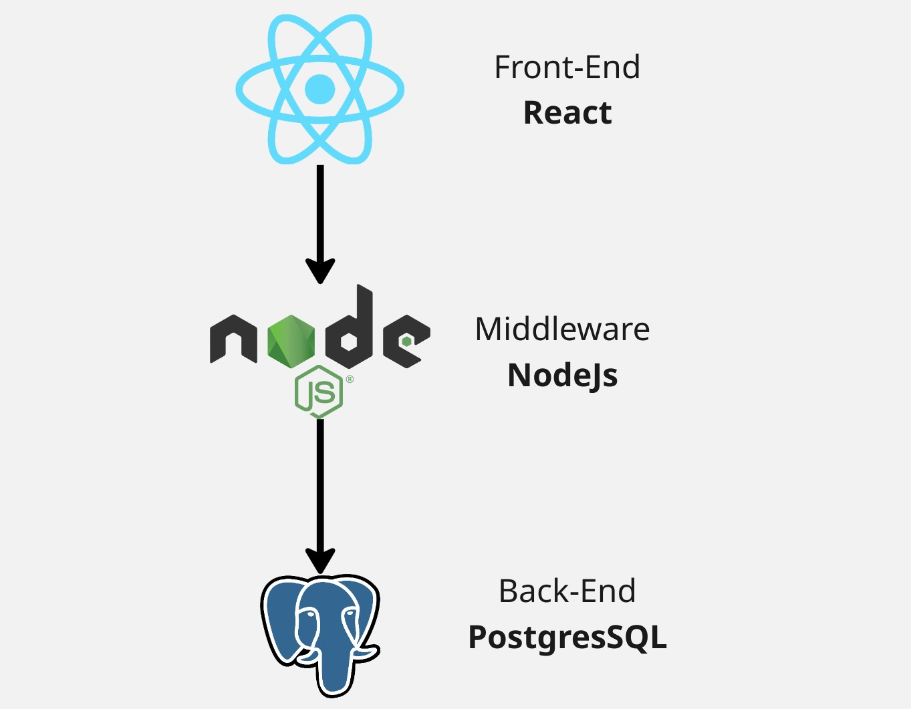

# Sricpt de despliegue de aplicacion

Vamos a crear una aplicacion que tenga tres componentes
1. Front-End con React
2. Middleware con NodeJs o SpringBoot
3. Back-End con PostgresSQL



## Despliegue de la app en local

- Creamos la base de datos dentro de podman
```shell
# Creamos la red dentro de podman
$ podman network create apps

# Creamos el pod, le agregamos la red de apps y exponemos el puerto 5432
$ podman pod create --name postgres --network apps -p 5432:5432

# Creamos la base de postgres en podman
$ podman run --name postgresPersona -d -e POSTGRES_PASSWORD=Admin1_Admin1 -e POSTGRES_USER=admin -e POSTGRES_DB=persona --pod=postgres -v ~/postgresPersona:/var/lib/postgresql/data:Z postgres
```
- Creamos nuestro middleware de NodeJs en mi caso lo pueden ver desde el siguiente Git
[Middleware](https://github.com/trixlan/middleware-nodejs.git)

**Nota:** Deben tener instalado node en la version 22
```shell
# Clonamos el repositorio
$ git clone https://github.com/trixlan/middleware-nodejs.git

# Nos movemos a la carpeta que se creo
$ cd middleware-nodejs

# Instalamos todos los paquetes del proyeto 
$ npm install

# Ejecutamos la aplicacion
$ node app.js
```
- Creamos nuesto front-end de React desde el siguiente Git
[Front-End](https://github.com/trixlan/front-react.git)

```shell
# Clonamos el repositorio
$ git clone https://github.com/trixlan/front-react.git

# Nos movemos a la carpeta que se creo
$ cd front-react

# Instalamos todos los paquetes del proyeto 
$ npm install

# Ejecutamos la aplicacion
$ npm run dev
```

## Despliegue de la app en Podman

- Usaremos la misma base del ejercicio anterior
- Vamos a crear la imagen del contenedor de middleware-nodejs y con esa imagen vamos a correr la aplicacion dentro de podman

```shell
# Creamos el pod del middleware conectado a la red de apps y exponiendo el puerto 3000
$ podman pod create --name nodejs --network apps -p 3000:3000

# Nos movemos a la carpeta del middleware
$ cd middleware-nodejs

# Creamos la imagen middleware-nodejs usando el Dockerfile
$ podman build -t middleware-nodejs .

# Ejecutamos la aplicacion con podman y la metemos al pod de nodejs
$ podman run --name middleware-nodejs --pod nodejs  localhost/middleware-nodejs:latest
```
- Creamos nuesto front-end en podman

```shell
# En este caso no es necesario crear el pod porque no usaremos la red de apps, la comunicacion se realizara por medio de localhost
# Nos movemos a la carpeta del front
$ cd front-react

# Generamos la pagina statica de la aplicacion, no va a generar una carpeta dist
$ npm run build

# Creamos la imagen front-react usando el Dockerfile
$ podman build -t front-react .

 Ejecutamos la aplicacion con podman
$ podman run --name front-react -d -p 8080:80 localhost/front-react:latest
```

## Despliegue de la app en Podman

- Se muestra en el video

## Despliegue de middleware de SpringBoot

- Creamos nuestro middleware de SpringBoot en mi caso lo pueden ver desde el siguiente Git
[Middleware](https://github.com/trixlan/middleware-springboot.git)

**Nota:** Tambien se puede desplegar en OpenShift usando una imagen de java, parecido al despliegue de React
```shell
# Clonamos el repositorio
$ git clone https://github.com/trixlan/middleware-springboot.git

# Nos movemos a la carpeta que se creo
$ cd middleware-springboot

# Debe estar instalado Java en la version 17 o superior

# Ejecutamos la aplicacion
$ ./mvnw spring-boot:run
```